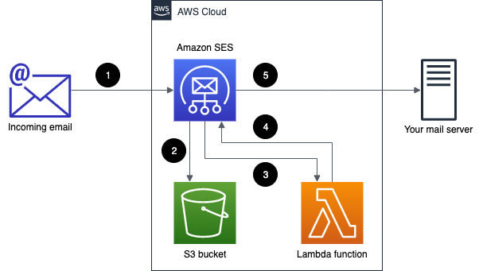
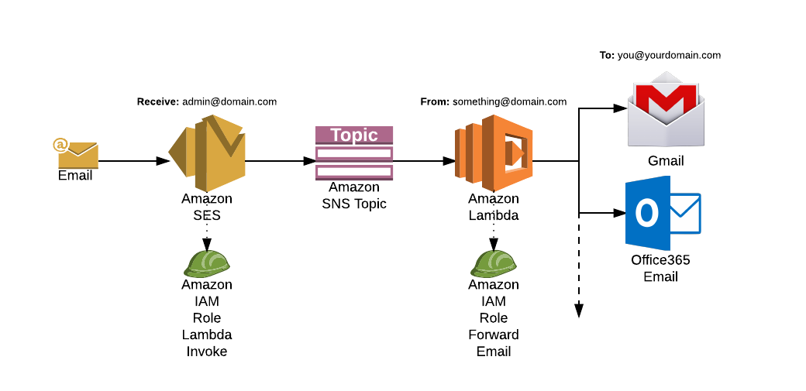

# SES Forwarder Terraform

### Lambda function source: https://github.com/arithmetric/aws-lambda-ses-forwarder

## Architecture

Source: https://aws.amazon.com/blogs/messaging-and-targeting/forward-incoming-email-to-an-external-destination/

Source: https://medium.com/@ashan.fernando/forwarding-emails-to-your-inbox-using-amazon-ses-2d261d60e417

## Prerequisites

* You have a domain in AWS
* You have a validated your domain in AWS SES
* If you have not configured inbound email handling, create a new Rule Set. Otherwise, you can use an existing one.
* You have configured the DNS MX record for your domain to point to the email receiving SES endpoint e.g. `inbound-smtp.us-west-2.amazonaws.com`
* Know what Terraform is
* Know what all the components are in the diagrams above (ish)

## How to Use

1. Create a Terraform backend S3 bucket to store your state files
2. Copy and paste the `example` folder somewhere on your computer
3. Configure `backend.tf` to point at the S3 bucket you just created
4. Configure `terraform.tfvars` as per the variable descriptions in `variables.tf`
5.  Run `terraform init && terraform apply`

* The steps above will set up a serverless mailbox for one email. You can copy and paste the example folder and repeat the steps to create multiple mailboxes (make sure your change the Terraform backend key).
* The `sns_email_address` variable is the email where error notifications will be sent to, so if you're administering several mailboxes you would keep this address the same for each one.

## Inputs

| Name | Description | Type | Default | Required |
|------|-------------|------|---------|:--------:|
| account\_id | The AWS account ID | `any` | n/a | yes |
| bucket\_name | The name of the S3 bucket where emails will be stored | `any` | n/a | yes |
| cloudwatch\_alarm | The name of the CloudWatch alarm monitoring the Lambda function | `any` | n/a | yes |
| cloudwatch\_metric | The name of the metric used for detecting Lambda runtime errors | `any` | n/a | yes |
| lambda\_name | The name of the Lambda function | `any` | n/a | yes |
| lambda\_recipient | Where the Lambda function will send/forward the sent mail to | `any` | n/a | yes |
| lambda\_role\_name | The name of the IAM role used by the Lambda function | `any` | n/a | yes |
| mail\_s3\_prefix | Folder prefix where emails will be stored e.g. /mail | `any` | n/a | yes |
| region | Must be either us-west-2, us-east-1 or eu-west-1 (where SES receiving is) | `string` | `"us-west-2"` | no |
| ses\_mail\_recipient | The email address that the sender used | `any` | n/a | yes |
| ses\_rule\_name | The name of the SES rule that invokes the Lambda function | `any` | n/a | yes |
| ses\_set\_name | The name of the active Rule Set in SES which you have already configured | `any` | n/a | yes |
| sns\_display\_name | The friendly name of the SNS topic | `any` | n/a | yes |
| sns\_email\_address | The email address used to send error notifications to | `any` | n/a | yes |
| sns\_protocol | The SNS protocol | `string` | `"email"` | no |

## Limitations

* SES only allows receiving email sent to addresses within verified domains: http://docs.aws.amazon.com/ses/latest/DeveloperGuide/verify-domains.html

* SES only allows sending emails up to 10 MB in size (including attachments after encoding): https://docs.aws.amazon.com/ses/latest/DeveloperGuide/limits.html

* Initially SES users are in a sandbox environment that has a number of limitations: http://docs.aws.amazon.com/ses/latest/DeveloperGuide/limits.html

Source: https://github.com/arithmetric/aws-lambda-ses-forwarder

## Other Documentation

* https://github.com/arithmetric/aws-lambda-ses-forwarder
* https://aws.amazon.com/blogs/messaging-and-targeting/forward-incoming-email-to-an-external-destination/
* https://medium.com/@ashan.fernando/forwarding-emails-to-your-inbox-using-amazon-ses-2d261d60e417
* https://github.com/cloudposse/terraform-aws-ses-lambda-forwarder
